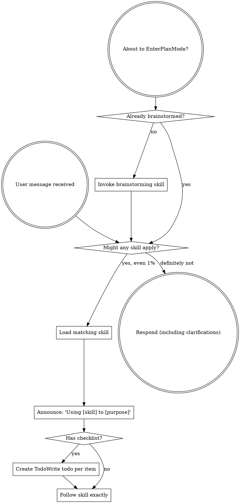

<SUBAGENT-STOP>
If you were dispatched as a subagent to execute a specific task, skip this skill.
</SUBAGENT-STOP>

<EXTREMELY-IMPORTANT>
If you think there is even a 1% chance a skill might apply to what you are doing, you ABSOLUTELY MUST invoke the skill.

IF A SKILL APPLIES TO YOUR TASK, YOU DO NOT HAVE A CHOICE. YOU MUST USE IT.

This is not negotiable. This is not optional. You cannot rationalize your way out of this.
</EXTREMELY-IMPORTANT>

## Instruction Priority

Superpowers skills override default system prompt behavior, but **user instructions always take precedence**:

1. **User's explicit instructions** (`AGENTS.md`, `GEMINI.md`, direct requests) — highest priority
2. **Superpowers skills** — override default system behavior where they conflict
3. **Default system prompt** — lowest priority

If `AGENTS.md` or `GEMINI.md` says "don't use TDD" and a skill says "always use TDD," follow the user's instructions. The user is in control.

## How to Access Skills

**In Claude Code:** Use the `Skill` tool. When you invoke a skill, its content is loaded and presented to you. Follow it directly.

**In Copilot CLI:** Use the `skill` tool. Skills are auto-discovered from installed plugins.

**In Gemini CLI:** Skills activate via the `activate_skill` tool. Gemini loads skill metadata at session start and activates the full content on demand.

**In Codex:** Skills load natively through the installed skill directory. Follow the matching skill instructions directly when a skill is triggered or explicitly requested.

**In other environments:** Check your platform's documentation for how skills are loaded.

## Platform Adaptation

Skills may reference canonical tool concepts such as skill loading, task tracking, subagent dispatch, file edits, and shell access. If your platform uses different tool names, map them using `references/copilot-tools.md` (Copilot CLI), `references/codex-tools.md` (Codex), or `references/gemini-tools.md` (Gemini CLI).

# Using Skills

## The Rule

**Invoke relevant or requested skills BEFORE any response or action.** Even a 1% chance a skill might apply means that you should invoke the skill to check. If an invoked skill turns out to be wrong for the situation, you don't need to use it.

## Small Menial Work Exception

If the user asks for **small menial work** that is obviously minor — roughly **1-2 small file edits** with no meaningful design work, architecture choice, or feature shaping — you may skip the heavyweight upfront workflow:

- skip `brainstorming`
- skip `writing-plans`
- skip `using-git-worktrees`
- do the work directly in the **current worktree**

This exception is narrow. It does **not** waive any other applicable skills. If the task is a bug, use `systematic-debugging`. If it is a feature or bugfix, use `test-driven-development`. If you are editing skills, use `writing-skills`. Before claiming success, use `verification-before-completion`.

**Red flags — do NOT use this exception when:**
- the task changes behavior in a non-obvious way
- the task needs design discussion or trade-offs
- the task touches more than 1-2 files or requires coordinated edits
- the task introduces new functionality, refactoring, or architecture changes
- you are calling it "small" mostly to avoid process

## Red Flags

These thoughts mean STOP—you're rationalizing:

| Thought | Reality |
|---------|---------|
| "This is just a simple question" | Questions are tasks. Check for skills. |
| "This is tiny, so I can skip all skills" | Tiny work may skip only the heavyweight upfront workflow, not other applicable skills. |
| "I need more context first" | Skill check comes BEFORE clarifying questions. |
| "Let me explore the codebase first" | Skills tell you HOW to explore. Check first. |
| "I can check git/files quickly" | Files lack conversation context. Check for skills. |
| "Let me gather information first" | Skills tell you HOW to gather information. |
| "This doesn't need a formal skill" | If a skill exists, use it. |
| "I remember this skill" | Skills evolve. Read current version. |
| "This doesn't count as a task" | Action = task. Check for skills. |
| "The skill is overkill" | Simple things become complex. Use it. |
| "I'll just do this one thing first" | Check BEFORE doing anything. |
| "This feels productive" | Undisciplined action wastes time. Skills prevent this. |
| "I know what that means" | Knowing the concept ≠ using the skill. Invoke it. |

## Skill Priority

When multiple skills could apply, use this order:

1. **Process skills first** (brainstorming, debugging) - these determine HOW to approach the task
2. **Implementation skills second** (frontend-design, mcp-builder) - these guide execution

"Let's build X" → brainstorming first, then implementation skills.
"Fix this bug" → debugging first, then domain-specific skills.

## Skill Types

**Rigid** (TDD, debugging): Follow exactly. Don't adapt away discipline.

**Flexible** (patterns): Adapt principles to context.

The skill itself tells you which.

## User Instructions

Instructions say WHAT, not HOW. "Add X" or "Fix Y" doesn't mean skip workflows.
